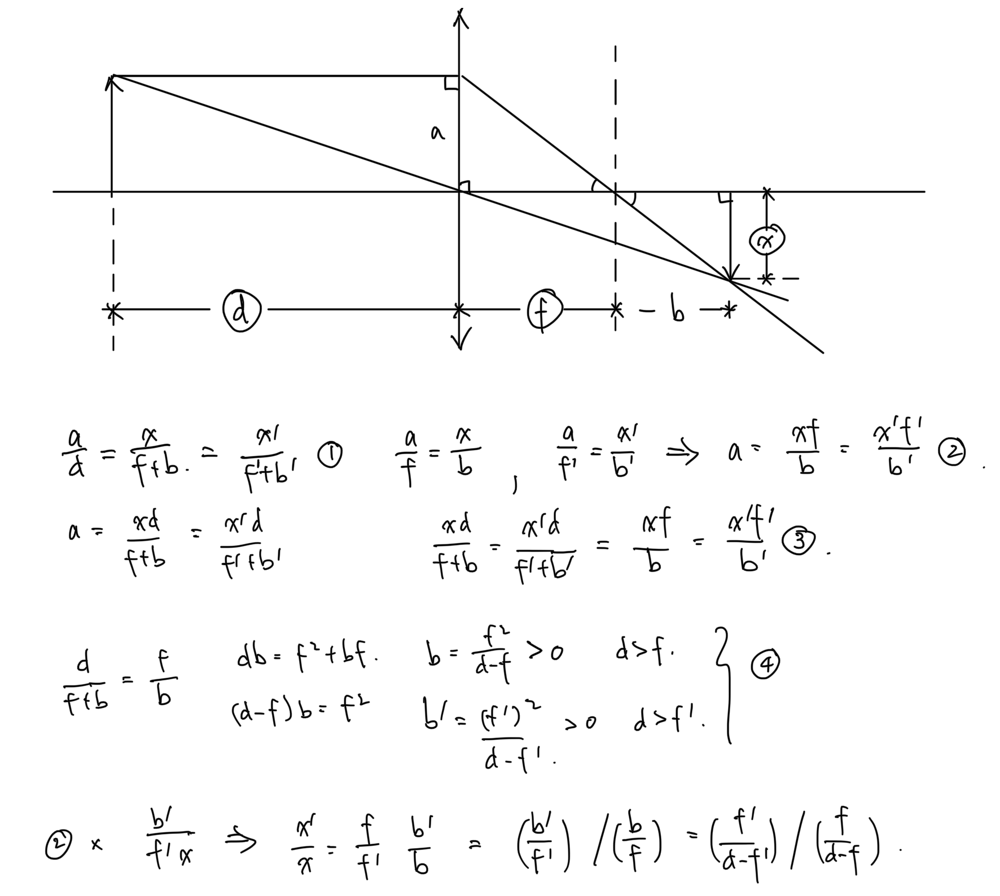

# Readjust Focal Length
Template intended for development in a container.

To produce the depth maps from the included `sample.heic`:
```
brew install libheif
heif-convert --with-aux sample.heic sample.jpg
```

So far I've found that OpenCV worked best for infilling [here](test.ipynb).

Using stable-diffusion yielded poor noisy results [here](https://colab.research.google.com/drive/1IWzy9WmxbSDrtwdUIF4CqN4A7fjAazT_?usp=sharing).
This is possibly due to the type of continguous and well-behaved masking that's better for transformers.

## Lens Formula

